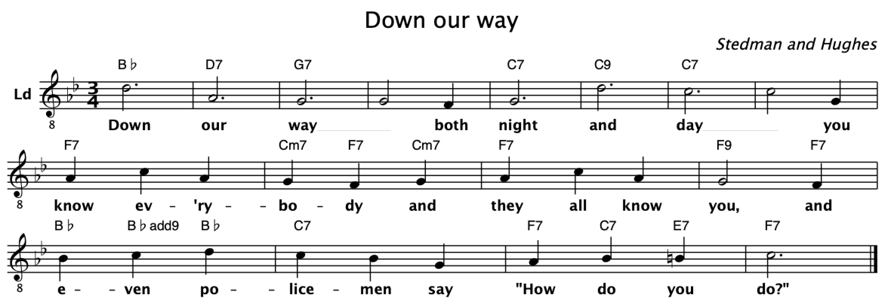
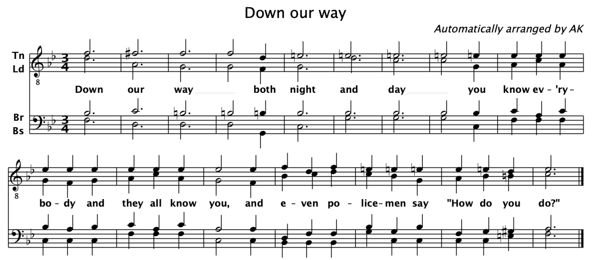

# Automatic Barbershop Arranger

This program takes a melody and some chords as input and will automatically produce a four-part barbershop arrangement out of it. Elementary arranging rules will be respected.

For instance, say that you are asking the ABA to arrange the [melody and chords of "Down Our Way"](https://github.com/alexanderkoller/arranger/blob/master/down_our_way.abc):



It might then produce the following arrangement, which is close but not identical to the Polecat arrangement:



## Running the Automatic Barbershop Arranger

You will need a recent version of [Java](https://www.java.com) to run the ABA.

Download the most [recent release](https://github.com/alexanderkoller/arranger/releases) of the ABA, or build it yourself from the current sources.

Then on your command line, run the ABA as follows:

```
java -jar arranger-1.0.jar -o <outputfile.abc> <inputfile.abc>
```

Replace `<inputfile.abc>` by the file that contains your melody and chords in [ABC notation](http://abcnotation.com/). As an example, have a look at the file [down_our_way.abc](https://github.com/alexanderkoller/arranger/blob/master/down_our_way.abc) in this repository. Replace `<outputfile.abc>` by the name of the file to which you want the arrangement to be written. If you don't specify an output file name, `arranged.abc` will be used by default.

## Viewing ABC files

There is quite a bit of software for editing, viewing, and playing ABC files. You need to be careful that your ABC software supports ABC version 2.1; older versions of ABC did not support multiple voices. I have been quite happy with [EasyABC](https://www.nilsliberg.se/ksp/easyabc/).