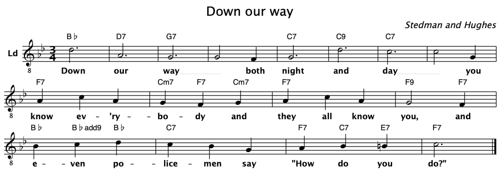
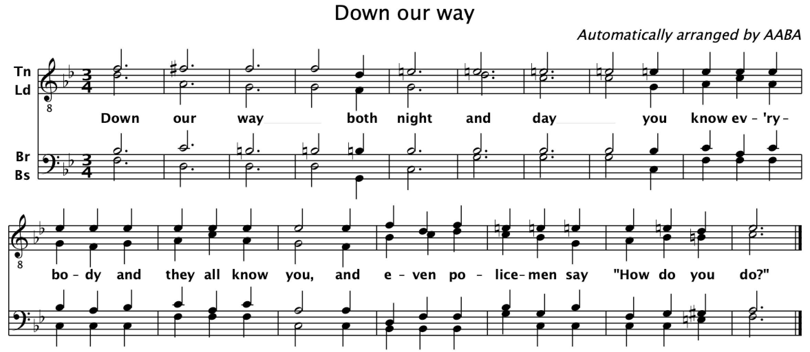

# AABA: <br/> Alexander's Automatic Barbershop Arranger

This program takes a melody and some chords as input and will automatically produce a four-part barbershop arrangement out of it. [Elementary arranging rules](https://github.com/alexanderkoller/aaba/wiki/Arranging-Rules) will be respected.

For instance, say that you are asking AABA to arrange the [melody and chords of "Down Our Way"](https://github.com/alexanderkoller/aaba/blob/master/down_our_way.abc):



It might then produce the following arrangement, which is close but not identical to the Polecat arrangement:



## Running AABA

You will need a recent version of [Java](https://www.java.com) to run AABA.

Download the most [recent release](https://github.com/alexanderkoller/aaba/releases) of AABA, or build it yourself from the current sources.

Then on your command line, run AABA as follows:

```
java -jar arranger-1.0.jar -o <outputfile.abc> <inputfile.abc>
```

Replace `<inputfile.abc>` by the file that contains your melody and chords in [ABC notation](http://abcnotation.com/) (see below). Replace `<outputfile.abc>` by the name of the file to which you want the arrangement to be written. If you don't specify an output file name, `arranged.abc` will be used by default.

## ABC music notation

AABA uses text files in [ABC format](http://abcnotation.com/) both for the input files (melody + chords) and for the output files (arrangement). You need to prepare the melody and chords in ABC format yourself, and you will need additional software for viewing and playing the generated arrangements.

As an example, have a look at the file [down\_our\_way.abc](https://github.com/alexanderkoller/aaba/blob/master/down_our_way.abc) in this repository. The notation of the chords is documented [here](https://alexanderkoller.github.io/aaba/javadoc/de/saar/coli/arranger/Chord.ChordType.html).

There is quite a bit of software for editing, viewing, and playing ABC files. You need to be careful that your ABC software supports ABC version 2.1; older versions of ABC did not support multiple voices. I have been quite happy with [EasyABC](https://www.nilsliberg.se/ksp/easyabc/).

## Documentation

Check out the [Github wiki](https://github.com/alexanderkoller/aaba/wiki) and the [Javadoc](https://alexanderkoller.github.io/aaba/javadoc/index.html) for more details.
